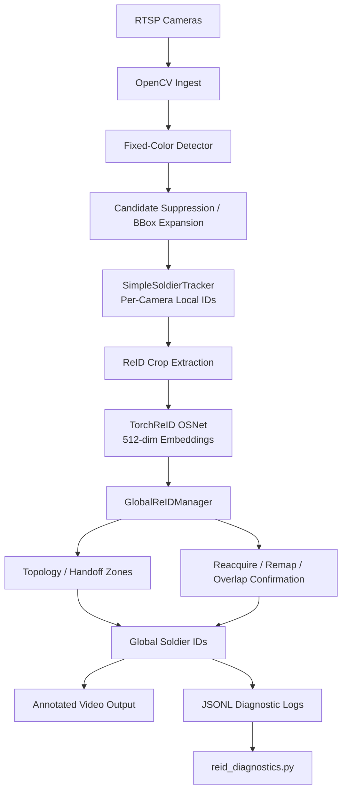
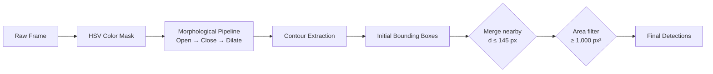
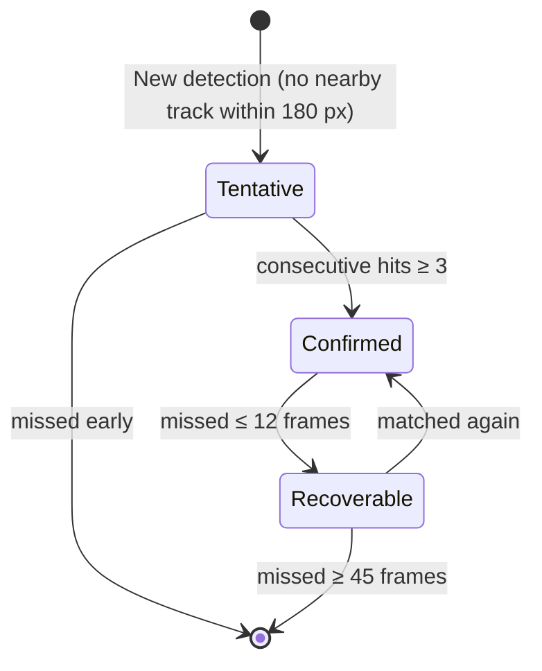
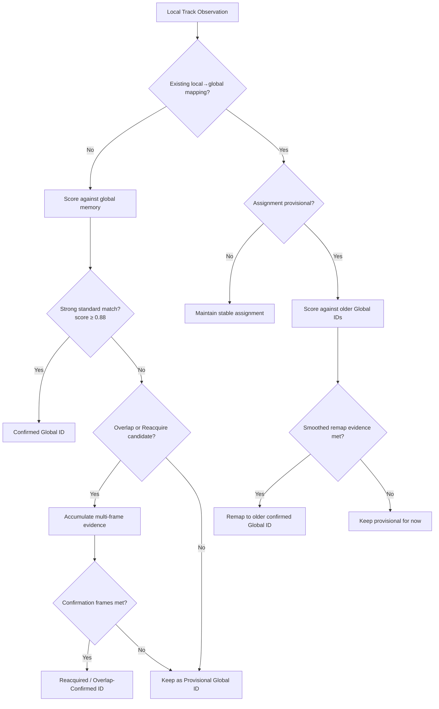
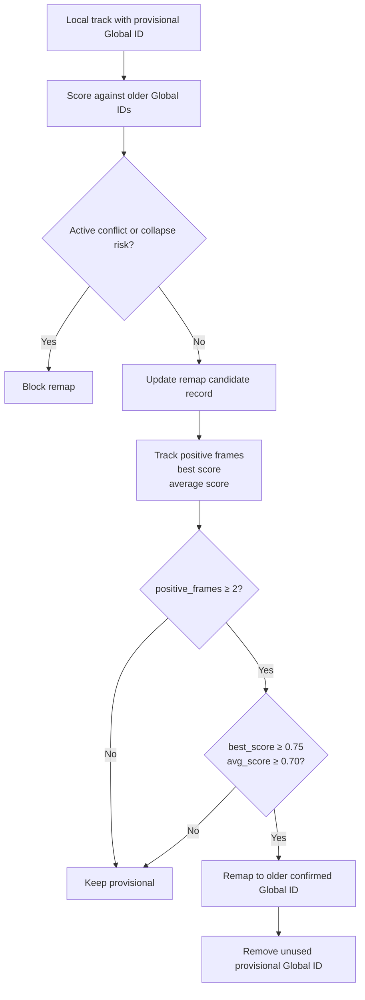
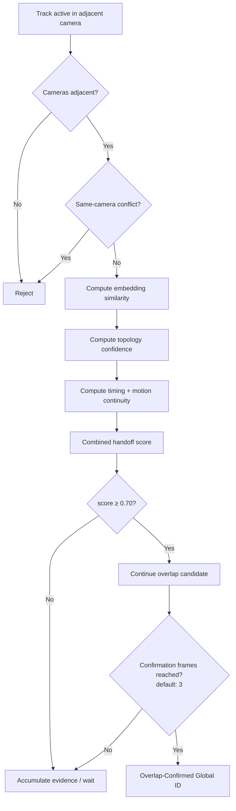

# MTS — Multi-Camera Tracking System

**Persistent cross-camera person identity for constrained uniform environments.**

MTS is a multi-camera person re-identification (ReID) system designed for environments where persons wear visually similar uniforms under top-down cameras. Standard appearance-based ReID is insufficient in these conditions — identical clothing gives high similarity for *different* people and unstable similarity for the *same* person across views.

MTS addresses this by treating visual appearance as **one signal among many**: embedding similarity is combined with camera topology, temporal continuity, motion continuity, world-space proximity, and handoff-zone occupancy to make conservative, multi-frame-confirmed identity decisions.

https://github.com/user-attachments/assets/80dd022e-09b1-4e48-9d22-9372f277a543

---

## System Architecture



---

## 1. Detection Layer

MTS uses a deterministic **fixed-color HSV detector** tuned to the visual signature of the target environment. This avoids the false-negative rate and dependency overhead of general ML detectors on top-down, small-target views, and produces stable, predictable detections that allow the identity and tracking layers to be validated independently.

The detector applies a morphological pipeline to isolate person bounding boxes from each raw frame:



Detection is abstracted behind a `BaseDetector` interface and constructed via a factory, allowing future detector backends (YOLO, pose-based) to be swapped in without changes to the tracking or identity layers.

| Parameter | Default | Role |
|---|---|---|
| HSV lower bound | (35, 35, 25) | Minimum H/S/V thresholds |
| HSV upper bound | (95, 255, 210) | Maximum H/S/V thresholds |
| Minimum contour area | 1,000 px² | Noise suppression |
| Merge distance | 145 px | Nearby-box consolidation |

---

## 2. Local Tracking

Each camera runs an independent **SimpleSoldierTracker** that maintains stable local track IDs across frames using nearest-neighbor matching with velocity-predicted position estimation and bounding-box size consistency checks.

Local IDs are not treated as global identity — they are the raw base layer for each individual camera view.

### Track State Machine



| State | Description |
|---|---|
| **Tentative** | New detection not yet trusted as a real track |
| **Confirmed** | Stable active track |
| **Recoverable** | Temporarily unmatched; still eligible for reattachment |
| **Expired** | Removed from tracker state |

| Parameter | Default | Description |
|---|---|---|
| Match distance | 180 px | Maximum nearest-neighbor match radius |
| Confirmation threshold | 3 frames | Hits required to promote tentative → confirmed |
| Max missed (active) | 12 frames | Frames before moving to recoverable |
| Recoverable window | 45 frames | Frames before final expiry |

---

## 3. ReID Embeddings

Confirmed local tracks generate **ReID crops** — padded bounding-box cutouts from the current frame — which are batch-processed by a TorchReID **OSNet** model to produce fixed-length, L₂-normalized appearance embeddings.

$$\mathbf{e} = \mathrm{OSNet}(I_{\mathrm{crop}}), \quad \mathbf{e} \in \mathbb{R}^{512}, \quad \|\mathbf{e}\|_2 = 1$$

Appearance similarity between any two embeddings is measured by cosine similarity:

$$\mathrm{sim}(\mathbf{e}_a,\, \mathbf{e}_b) = \frac{\mathbf{e}_a \cdot \mathbf{e}_b}{\|\mathbf{e}_a\| \cdot \|\mathbf{e}_b\|}$$

| Property | Value |
|---|---|
| Model | OSNet x1\_0 |
| Input size | 256 × 128 px (RGB) |
| Embedding dimension | 512 |
| Normalization | L₂ |
| Update interval | Every 5 frames (default) |
| Batch size | 32 crops |

Embeddings are maintained per global track in a rolling memory and averaged over recent observations to reduce single-frame noise.

---

## 4. Global Identity Fusion

The `GlobalReIDManager` owns cross-camera identity persistence. It maintains a registry of **Global Soldier IDs** that survive occlusion, re-entry, and camera transitions.

### Standard Match Score

When a new local track observation arrives without an existing global mapping, it is scored against all active global tracks using a weighted composite:

$$\mathrm{score} = \frac{w_e \cdot \mathrm{sim_{emb}} + w_t \cdot \mathrm{score_{time}} + w_w \cdot \mathrm{score_{world}} + w_c \cdot \mathrm{score_{cam}}}{w_e + w_t + w_w + w_c}$$

| Signal | Weight | Description |
|---|---|---|
| Embedding similarity $w_e$ | **0.55** | OSNet cosine similarity between embeddings |
| Temporal score $w_t$ | **0.20** | Recency decay since the global ID was last observed |
| World proximity $w_w$ | **0.15** | Physical distance in the shared world coordinate space |
| Camera adjacency $w_c$ | **0.10** | Declared adjacency between source cameras |

### Decision Thresholds

| Global ID State | Score Threshold | Trigger Condition |
|---|---|---|
| **Confirmed** | ≥ 0.88 | Strong standard match accepted |
| **Overlap-Confirmed** | ≥ 0.78 | Match evidence within an overlap zone |
| **Reacquired** | ≥ 0.82 | Track re-attached after fragmentation or handoff gap |
| **Remapped** | ≥ 0.75 (avg ≥ 0.70) | Provisional assignment corrected to older confirmed ID |
| **Provisional** | No strong match | New temporary global ID assigned; eligible for later correction |

### Global Fusion Decision Flow



### Remap Correction

Live testing showed that a fragmented local track can receive a provisional new Global ID, then later produce strong evidence pointing back to the correct older global identity. The remap mechanism corrects this:



### Identity Collapse Prevention

The manager enforces structural guards to prevent global identity errors:

- **Same-camera conflict guard** — no two active same-camera local tracks may share one global ID
- **Active ID theft prevention** — a global ID held by another camera cannot be claimed without handoff evidence
- **Non-adjacent merge prevention** — cameras without a declared adjacency relationship cannot trigger automatic handoff
- **Minimum confirmation window** — remaps and reacquisitions require ≥ 2 positive confirmation frames; no single-frame identity changes are permitted

---

## 5. Handoff Topology

When a person transitions between adjacent cameras, they often appear in **both views simultaneously** during the crossing window. The handoff topology layer detects and exploits this overlap window to make high-confidence identity handoffs that pure appearance matching alone could not safely support.

### Handoff Zones

Operators pre-define rectangular zones (via an interactive GUI editor) in each camera view marking where inter-camera transitions are expected. Zones are stored as JSON and loaded at runtime:

```json
{
  "camera_id": "cam1",
  "frame_width": 1280,
  "frame_height": 720,
  "zones": [
    {
      "zone_id": "exit_right",
      "type": "rect",
      "xyxy": [900, 0, 1280, 720]
    }
  ]
}
```

### Edge-Percentage Zones

For coarser configuration, edge-percentage zones mark a fraction of a camera frame boundary as a handoff region (e.g. `cam1:right:0.20` = rightmost 20% of cam1's frame).

| Component | Weight |
|---|---|
| BBox occupancy in edge zone | 0.45 |
| Motion direction toward edge | 0.30 |
| Temporal proximity | 0.20 |
| Complementary edge bonus | 0.05 |

### Handoff Combined Score

When topology evidence is detected, the standard identity score is replaced by a topology-weighted composite:

$$\mathrm{score_{handoff}} = 0.35 \cdot \mathrm{sim_{emb}} + 0.30 \cdot \mathrm{score_{topology}} + 0.20 \cdot \mathrm{score_{motion}} + 0.15 \cdot \mathrm{score_{time}}$$

### Overlap Handoff Flow



### Manual Zone Topology Score

$$\mathrm{score_{topology}} = r_{\mathrm{overlap}} \cdot w_{\mathrm{bbox}} + b_{\mathrm{center}} \cdot w_{\mathrm{center}} + \left(1 - \frac{d}{d_{\mathrm{max}}}\right) \cdot w_{\mathrm{prox}}$$

Where:
- $r_{\mathrm{overlap}}$ — bounding-box / zone intersection ratio (minimum threshold: 0.10)
- $b_{\mathrm{center}}$ — binary bonus: 1 if bbox center lies inside the zone rectangle, else 0
- $d$ — Euclidean distance from bbox center to zone center; $d_{\mathrm{max}} = 120\ \mathrm{px}$

The final topology confidence feeds into the handoff combined score with weight 0.30, alongside temporal (0.25) and motion (0.15) components.

---

## 6. World-Space Coordinate Mapping

Each camera's pixel coordinates are projected into a shared **world coordinate system** via per-camera calibration, enabling geometric proximity scoring between tracks across different cameras.

### Supported Transforms

**Affine (rotation + scale + translation):**

$$\begin{pmatrix} x_w \\ y_w \end{pmatrix} = \mathbf{A}_{2 \times 2} \begin{pmatrix} x_l \\ y_l \end{pmatrix} + \mathbf{t}$$

**Homography (full perspective correction):**

$$\begin{pmatrix} x_w \\ y_w \\ 1 \end{pmatrix} \sim \mathbf{H}_{3 \times 3} \begin{pmatrix} x_l \\ y_l \\ 1 \end{pmatrix}$$

Person ground position is taken from the **bounding-box center** — not the bottom-center convention used in upright-camera setups — because near-top-down camera geometry makes the geometric centroid a better approximation of the person's actual ground position.

---

## 7. Identity States

| State | Description |
|---|---|
| **Local Soldier ID** | Per-camera ID from `SimpleSoldierTracker`. Stable only within a single camera while detections remain continuous. |
| **Provisional Global** | New cross-camera identity created when no confirmed match was yet safe. Eligible for later remap correction. |
| **Confirmed Global** | Assignment accepted via standard global ReID score ≥ 0.88. |
| **Overlap-Confirmed Global** | Assignment confirmed through adjacent-camera overlap handoff evidence over multiple frames. |
| **Reacquired Global** | A new local track successfully re-attached to an older global identity after a fragmentation or handoff gap. |
| **Remapped Global** | An existing provisional local→global mapping corrected to an older, stronger confirmed global identity. |

---

## 8. Output & Observability

MTS writes structured per-frame JSONL records alongside annotated video output for post-session diagnostics and engineering review.

### JSONL Record Types

| Record Type | Contents |
|---|---|
| `detection` | Raw bbox, confidence score, camera source |
| `local_soldier_track` | Track ID, state, event type (created / matched / expired) |
| `reid_embedding` | Track ID, embedding dimension, crop metadata |
| `global_observation` | camera\_id + local\_id → global\_id mapping, event type |
| `global_track` | Global identity state, trajectory, local track mapping |
| `global_reid_diagnostics` | Per-frame candidate scores, confidence distribution |
| `track_event` | High-level events: reacquire, remap, overlap\_confirm |
| `structured_evidence` | Full evidence payload for external review integration |

### Key Diagnostics Metrics

| Metric | Description |
|---|---|
| `global_reid_matches` | Standard global matches accepted this session |
| `global_reid_reacquired` | Fragmented tracks successfully reattached to prior global IDs |
| `global_reid_remapped` | Provisional IDs corrected to older confirmed global identities |
| `new_global_ids` | Fresh global identities spawned this session |
| `overlap_transition_confirmed` | Handoff-zone-confirmed inter-camera transitions |
| `average_combined_handoff_score` | Session-mean topology-weighted handoff score |
| `manual_handoff_zone_hits` | Tracks observed inside a manual handoff zone |

---

*Designed and developed by SigmaWaveAI.*
