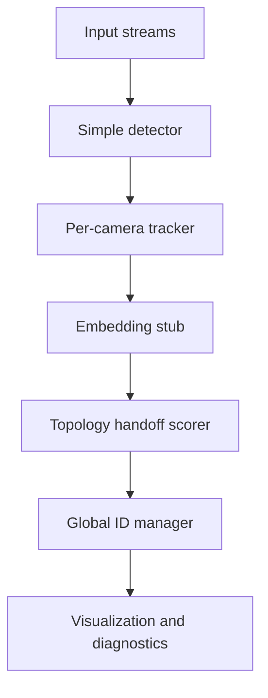

# Architecture

## Runtime modules

| Module | Purpose |
|---|---|
| `demo_multi_camera_reid.py` | Demo runner for webcams, videos, or synthetic frames. |
| `simple_detector.py` | Toy detector for colored person-like blobs. |
| `simple_tracker.py` | Lightweight centroid tracker per camera. |
| `reid_embedding_stub.py` | Deterministic color/geometry embedding stub. |
| `topology_handoff.py` | Manual-zone loading and zone confidence scoring. |
| `global_id_manager.py` | Conservative global ID assignment. |
| `zone_editor.py` | Interactive rectangle zone editor. |

## Data flow

## Design principles

- Keep local tracking stable before attempting global ReID.
- Avoid global ID collapse by blocking active conflicts.
- Use handoff zones to add physical evidence.
- Treat embeddings as one signal, not the only signal.
- Keep this public demo dependency-light and easy to inspect.

